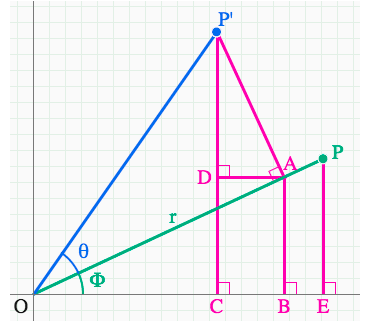

**Why are we using cos and sin for rotation?**

First off, it's a formula that is generally used for rotating matrices: https://www.khanacademy.org/computing/pixar/sets/rotation/v/sets-8

Let's reduce the code down to only the essential (and difficult) part.

What we can do is think of cos and sin as being

```javascript
x = uv.x * cos(rotation) - uv.y * sin(rotation);
y = uv.x * sin(rotation) + uv.y * cos(rotation);
```

**OR**

```javascript
x = xcos(θ) - ysin(θ);
y = xsin(θ) + ycos(θ);
```

**OR**

```math
vector v = xî + yĵ = (xcos(θ) - ysin(θ)) + (xsin(θ) + ycos(θ))
```

Here, we have just removed the variables that just moves the entire output vectors around vertically and horizontally.

This formula can be derived using just _trigonometry_ or with _linear transformations_.

<hr/>

**Derivation with trig**



For trig, it is derivation through substitutions and stuff: https://www.khanacademy.org/computing/pixar/sets/rotation/v/sets-9 <= watch

<hr/>

**Derivation with linear algebra**

Honestly, linear algebra is a much more intuitive way of thinking about transformations, especially rotation, than just pure trigonometry.

For the equation:

```javascript
x = uVu.x * cos(θ) - uVu.y * sin(θ);
y = uVu.x * sin(θ) + uVu.x * cos(θ);
```

Let us first transform it into a system of linear equations:

$$
\begin{bmatrix}
cos(θ) & -sin(θ)\\
sin(θ) & cos(θ)
\end{bmatrix}
\begin{bmatrix}
uVu.x \\
uVu.y
\end{bmatrix}
$$

We can think of uVu.x and uVu.y as î and ĵ. This simplifies things a lot. We are now saying that I have a vector and I would like to apply this linear transformation. Let's rewrite it a bit more.

$$
x
\begin{bmatrix}
cos(θ) \\
sin(θ)
\end{bmatrix}
+
y
\begin{bmatrix}
-sin(θ) \\
cos(θ)
\end{bmatrix}
$$

What we're doing here, essentially, is multiplying each coordinate of the vector by a transformed i hat and j hat.
For example, a 90 deg rotation would be pi/2. Putting that into the matrix we would get a new position for the i hat and j hat.

&&
\begin{bmatrix}
0 & -1 \\
1 & 0
\end{bmatrix}
&&

If we multiply the vector by a matrix, recall, that this means we are asking where the vector will land in relation to the transformed i hat and j hat.

In conclusion, for any rotation, for the sake of demonstration, $\pi$.

```javascript
x = uv.x * cos(pi / 2) - uv.y * sin(pi / 2);
y = uv.x * sin(pi / 2) + uv.y * cos(pi / 2);
```

is the same as

$$
\begin{bmatrix}
cos(\pi/2) & -sin(\pi/2)\\
sin(\pi/2) & cos(\pi/2)
\end{bmatrix}
\begin{bmatrix}
uVu.x \\
uVu.y
\end{bmatrix}
=
\begin{bmatrix}
x \\
y
\end{bmatrix}
$$
